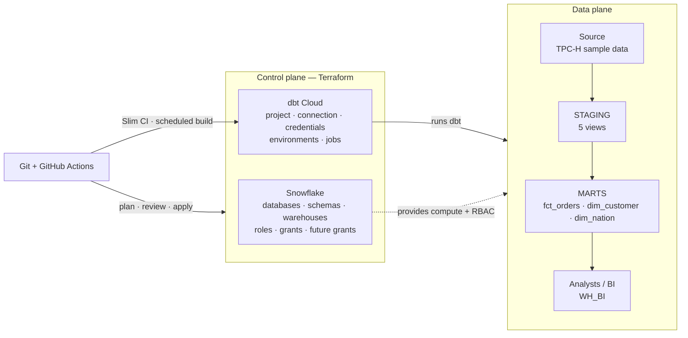

# LEAP Data Platform

An enterprise-shaped Snowflake + dbt platform where every piece of configuration is code,
reviewed in a pull request, and reproducible from scratch.

Built for the LEAP DevOps/Platform Engineer case study.

---

## The organising principle

> **Terraform owns the containers. dbt owns the contents.**

Terraform manages databases, schemas, warehouses, roles and **future grants** — the
slow-changing scaffolding. dbt creates tables and views inside that scaffolding at runtime.
Neither manages the other's objects.

That boundary resolves the question that otherwise causes chaos: *who grants permissions on a
table dbt created five minutes ago?* Nobody. Terraform declares, once, that anything appearing
in this schema is readable by this role.

The same split applies one level up: Terraform owns dbt Cloud's **configuration**, git owns
dbt's **SQL**.



---

## Repository layout

```
modules/snowflake_environment/   one environment, fully parameterised
    main.tf       databases, schemas, warehouse, roles
    grants.tf     object grants, including ON FUTURE
    users.tf      SVC_DBT_<ENV> service user
envs/dev/                        calls the module with environment = "dev"
envs/prod/                       environment = "prod", plus WH_BI and FR_ANALYST
envs/dbtcloud/                   dbt Cloud config; reads the other two states
dbt/                             the models
    models/staging/              5 views, 1:1 with sources
    models/marts/                star schema + 11 tests
    macros/                      custom schema resolution
docs/architecture.md             design decisions and trade-offs
.github/workflows/terraform.yml  plan on PR, gated apply on merge
```

Three `envs/` directories, three separate HCP Terraform workspaces, **three separate state
files** — so a broken apply in one cannot corrupt another.

---

## What exists in Snowflake

| | Dev | Prod |
|---|---|---|
| Landing zone | `RAW_DEV` | `RAW_PROD` |
| Transformed | `ANALYTICS_DEV` | `ANALYTICS_PROD` (`STAGING`, `MARTS`) |
| Compute | `WH_TRANSFORM_DEV` | `WH_TRANSFORM_PROD` |
| Access roles | `AR_DEV_READ` / `AR_DEV_WRITE` | `AR_PROD_READ` / `AR_PROD_WRITE` |
| Functional role | `FR_TRANSFORMER_DEV` | `FR_TRANSFORMER_PROD` |
| dbt identity | `SVC_DBT_DEV` | `SVC_DBT_PROD` |

Account-level: `WH_BI` and `FR_ANALYST` for read-only consumers.

**Two-tier RBAC.** Access roles hold every object grant. Functional roles describe jobs and
hold nothing but access roles. Users are granted functional roles only. Adding a database
means creating one access role, not editing every user.

---

## How people use it

| Persona | Works in | Writes to | Authenticates with |
|---|---|---|---|
| Analytics engineer | branch + dbt Cloud IDE | `ANALYTICS_DEV.DBT_<NAME>_*` | SSO → `FR_TRANSFORMER_DEV` |
| Platform engineer | Terraform pull requests | nothing directly — CI applies | SSO; CI uses key-pair |
| Analyst / BI | BI tool on `WH_BI` | nothing, read-only on marts | SSO → `FR_ANALYST` |
| Admin | break-glass only | — | `ACCOUNTADMIN` + MFA |

**Two pipelines gate every change:**

```
Terraform   PR → fmt · validate · plan (posted to the PR) → review
                 → merge → apply dev + dbtcloud → apply prod (requires approval)

dbt         PR → build only modified models into a temporary schema,
                 deferring everything upstream to production
                 → merge → scheduled production build
```

Environment separation is enforced by Snowflake RBAC, not by convention: a CI run *cannot*
write to `ANALYTICS_PROD` because the role it runs as has no privilege to.

---

## Manual bootstrap

Everything below was done by hand, once. Everything else is `terraform apply`.

| # | Step | Why it can't be automated |
|---|---|---|
| 1 | Snowflake trial account — Enterprise, AWS, EU (Stockholm) | Nothing exists for Terraform to connect to |
| 2 | Enrol MFA on the human admin user | Cannot bootstrap your own second factor |
| 3 | Generate RSA key pair (PKCS#8) at `~/.snowflake/keys/` | `tls_private_key` would write the private key into state |
| 4 | Create `SVC_TERRAFORM` with the public key (SQL below) | The credential Terraform authenticates with |
| 5 | Create the GitHub repository | Container for the code, not part of the platform |
| 6 | Create HCP Terraform organisation; set workspaces to Local execution | State backend must exist before `terraform init` |
| 7 | Create dbt Cloud account via Snowflake Partner Connect | Same bootstrap problem, second SaaS |
| 8 | Create a dbt Cloud service token | The credential the dbt Cloud provider authenticates with |

```sql
USE ROLE USERADMIN;
CREATE USER SVC_TERRAFORM
  TYPE              = SERVICE
  RSA_PUBLIC_KEY    = '<public key body, one line, no PEM header>'
  DEFAULT_ROLE      = SYSADMIN
  DEFAULT_WAREHOUSE = COMPUTE_WH
  COMMENT           = 'Terraform IaC service account. Created manually as part of bootstrap.';

USE ROLE SECURITYADMIN;
GRANT ROLE SYSADMIN      TO USER SVC_TERRAFORM;
GRANT ROLE SECURITYADMIN TO USER SVC_TERRAFORM;
```

`TYPE = SERVICE` means the user *cannot* authenticate with a password — Snowflake refuses it
structurally rather than by policy.

Partner Connect also creates `PC_DBT_DB`, `PC_DBT_ROLE`, `PC_DBT_USER` and `PC_DBT_WH`. These
are **deliberately unused**; Terraform builds clean, purpose-built equivalents. The dbt Cloud
project the onboarding wizard created was adopted with `terraform import` rather than deleted.

---

## Running it

```bash
export DBT_CLOUD_ACCOUNT_ID=<account id>
export DBT_CLOUD_HOST_URL=https://<cell>.dbt.com/api
export DBT_CLOUD_TOKEN=<service token>

terraform login

cd envs/dev      && terraform init && terraform apply
cd ../prod       && terraform init && terraform apply
cd ../dbtcloud   && terraform init && terraform apply
```

No secret is stored in this repository. The Snowflake private keys live outside it and are
referenced by path; dbt Cloud credentials use Terraform **write-only attributes**, so the key
is passed to the provider without ever being written to state.

### Adding an environment

```bash
cp -r envs/dev envs/staging
rm -rf envs/staging/.terraform envs/staging/.terraform.lock.hcl
```

Change the workspace name in `terraform.tf` and `environment = "staging"` in `main.tf`. The
module is not touched — which is why environments are provably the same shape rather than
copies that drift.

---

## Deliberately out of scope

| Not built | Why | What it would be |
|---|---|---|
| Ingestion / EL | Case scopes it out; no source system provided | Fivetran or Snowpipe landing into `RAW_*` |
| OIDC for CI | Needs a cloud account | Short-lived tokens instead of stored secrets |
| Resource monitors | Require `ACCOUNTADMIN`; the service account is deliberately narrower | Credit quotas with notify and suspend triggers |
| SSO / SCIM | Not available on a trial | SAML plus automated provisioning |
| Masking / row access policies | No sensitive data here | Tag-based masking on PII columns |
| Account-per-environment | Administration cost exceeds the case | Separate accounts under one organisation |

`RAW_DEV` and `RAW_PROD` are created but empty. They mark where an EL layer would land data,
and make explicit the boundary dbt must not write across. Sources currently point at
`SNOWFLAKE_SAMPLE_DATA.TPCH_SF1`; swapping them is a change to one YAML file.

Full design reasoning and rejected alternatives: [`docs/architecture.md`](docs/architecture.md).
